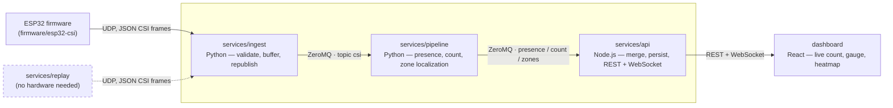

# wifi-sense

[](LICENSE)

Open-source WiFi CSI (Channel State Information) sensing platform that
counts people in a room and estimates their zone-level location — no
cameras required. An ESP32 captures fluctuations in WiFi signal
propagation (amplitude/phase across subcarriers), and a small ML pipeline
turns those fluctuations into occupancy and coarse position.

See [`CLAUDE.md`](CLAUDE.md) for the full architecture rationale and
coding conventions, [`docs/csi-frame-schema.md`](docs/csi-frame-schema.md)
for the CSI frame wire format, [`docs/roadmap.md`](docs/roadmap.md) for
where the project is headed, and [`CONTRIBUTING.md`](CONTRIBUTING.md) if
you'd like to help.

## Architecture



`services/replay` (dashed above) streams synthetic or real-recorded CSI in
the same wire format the ESP32 uses, so every downstream service can be
developed and tested — and the dashboard shown live — with no physical
hardware. `services/ingest` also exposes a debug live waterfall/heatmap of
its ring buffer for visually confirming CSI disturbances without waiting
on the rest of the pipeline. Full field-by-field detail on every hop is in
[`CLAUDE.md`](CLAUDE.md#architecture).

## Quick start

Clone this repository, then from its root:

```bash
docker compose up --build
```

That's it — starts `replay` (synthetic CSI, no hardware needed) → `ingest`
→ `pipeline` → `api` → `dashboard`, no manual steps. Open
**http://localhost:3000** for the live dashboard; `services/ingest`'s
debug waterfall is at **http://localhost:8090**.

People counting and zone localization are ML features that each need a
trained checkpoint (gitignored — regenerate locally, not committed);
without them the dashboard still shows live presence/motion-intensity
data, with an explicit "not loaded yet" state (and the exact command to
fix it) for count/zones. See `CLAUDE.md`'s "ML-based people counting" and
"Zone-level localization" sections to train/calibrate those.

## Layout

```
firmware/esp32-csi/   ESP-IDF firmware that captures CSI and emits UDP frames
services/ingest/      Python — receives CSI frames over UDP, validates, republishes over ZeroMQ
services/pipeline/    Python — preprocessing, presence detection, ML counting/localization
services/replay/      Python — streams synthetic or real (converted) CSI to emulate a live ESP32
services/api/         Node.js — merges pipeline output, serves REST + WebSocket, SQLite history
dashboard/            React — live count, motion gauge, zone heatmap, history chart
datasets/             Public CSI dataset conversion (gitignored output; see datasets/README.md)
docs/                 Shared schemas, roadmap, and design docs
room.yaml             Zone grid definition (default 2x3) for localization
docker-compose.yml    Runs the full pipeline end-to-end
```

Each directory under `services/`, `dashboard/`, and `firmware/` has its
own `README.md` with standalone run instructions (for fast local
iteration without Docker) as well as its docker-compose usage — start
there for details on any one piece.

## Contributing

Bug reports, feature PRs, and — especially — reports from anyone who's
flashed `firmware/esp32-csi` onto real hardware are all welcome. See
[`CONTRIBUTING.md`](CONTRIBUTING.md) for the workflow (standalone +
docker compose rule, coding conventions, test expectations) and
[`docs/roadmap.md`](docs/roadmap.md) for directions already under
discussion (multi-receiver tracking, TF-Lite edge inference, MQTT/Home
Assistant integration).

## License

[Apache License 2.0](LICENSE).
